# SugarGuard - 糖尿病风险管理小助手

SugarGuard 是一个面向糖尿病人群的健康管理 Web 应用：基于用户健康档案进行风险评估、生成生活方案，并提供日/周/月打卡、趋势可视化与提醒；同时通过 Dify Workflow/Agent 接入大模型能力，在不泄露 Key 的前提下实现智能解读与问答。

## 技术栈
- **前端**：React 19 + TypeScript + Vite
- **UI**：Tailwind CSS + Lucide React
- **路由**：React Router v7
- **AI 接入**：Dify Workflow / Chat（经由自建 Proxy 转发）
- **部署**：Nginx 静态托管 + 反向代理，Proxy 可用 Docker Compose 启动

## 主要能力
- **糖尿病风险预测**：根据基础健康指标与家族史生成风险提示与建议
- **生活方案定制**：生成饮食/运动等可执行方案，并落地到打卡任务
- **日/周/月打卡**：完成度统计、易漏项提示、月度总结
- **趋势可视化**：多指标折线趋势、目标区间、异常点提示
- **提醒系统**：按用户设置进行提醒（用于养成打卡习惯）
- **AI 问答**：健康助手 + 医师咨询入口（由 Dify Agent 支撑）

## 安全开源的 Dify 对接方式
前端不持有任何 Dify Key。所有 AI 调用统一走服务器转发：

```text
POST /api/dify/workflows/run
POST /api/dify/chat-messages
```

由你自己的小后端（本仓库 `server/`）在服务端读取环境变量中的 Dify Key 并转发到 Dify，这样项目可以安全开源到 GitHub。

## 本地运行（开发）
### 1) 安装依赖

```bash
pnpm install
```

### 2) 启动前端

```bash
pnpm dev
```

### 3) 可选：本地启动 Dify Proxy（如果你有 Dify）
在 `server/` 目录配置好 `.env`（只放本机/服务器，别提交），然后：

```bash
cd server
npm install
npm run start
```

## 服务器部署（最小可用）
### 1) 构建前端

```bash
pnpm build
```

### 2) 上传到服务器（示例路径）
把 `dist/`、`server/`、`deploy/` 上传到服务器的 `/opt/sugar-guard/`。

### 3) 配置 Dify Key（只在服务器保存）
在服务器创建 `/opt/sugar-guard/server/.env`，写入：
- `DIFY_API_BASE`：Dify API 基址（通常是 `http://127.0.0.1/v1` 或宿主机网关）
- `DIFY_APP_KEY_MAP`：各功能对应的 Dify App Key 映射（JSON）

### 4) 启动 Proxy + Nginx
- Proxy：`docker compose -f /opt/sugar-guard/deploy/docker-compose.proxy.yml up -d --build`
- Nginx：静态托管 `/var/www/sugar-guard`，并将 `/api/dify/` 反向代理到 `127.0.0.1:3001`

## 项目截图

| 模块 | 预览 |
| --- | --- |
| 登录 / 首页 | 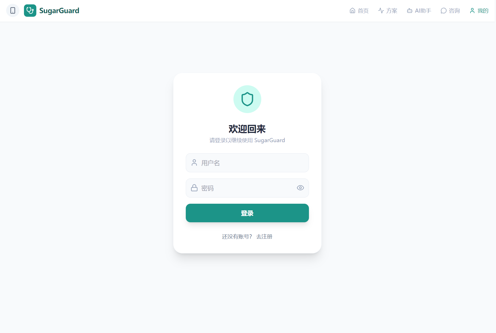<br/>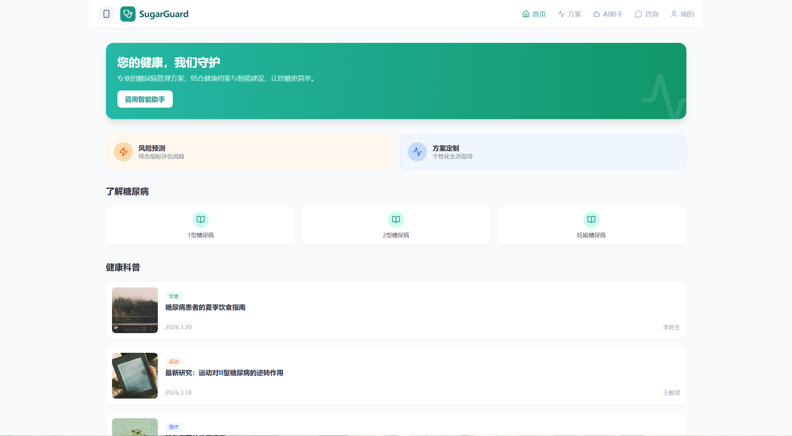 |
| 咨询与助手 | 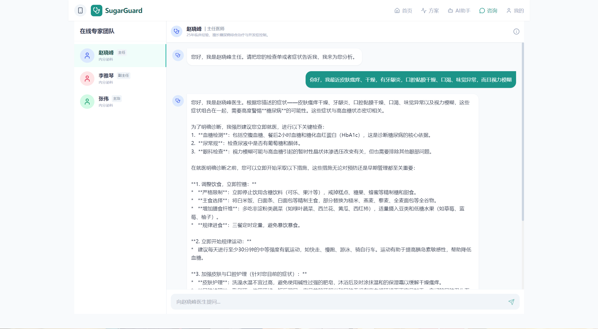<br/>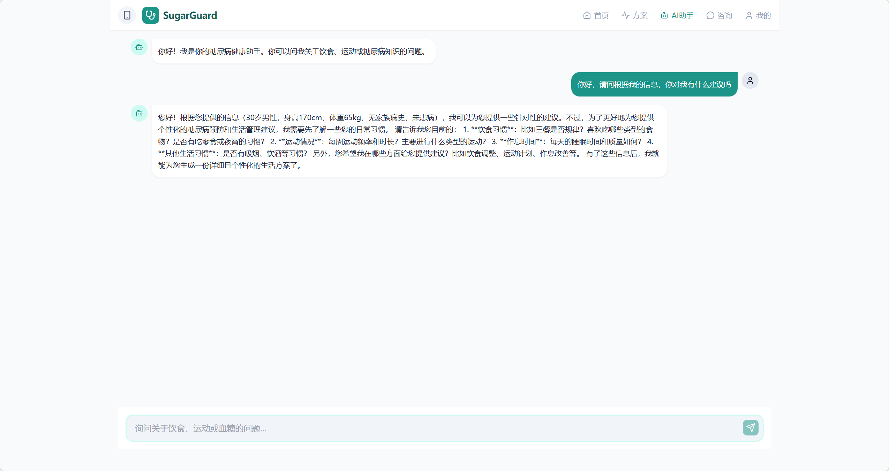 |
| 风险预测 | 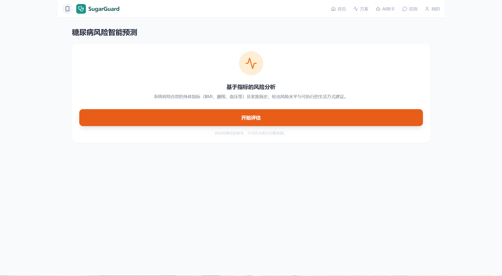 |
| 生活方案定制 | 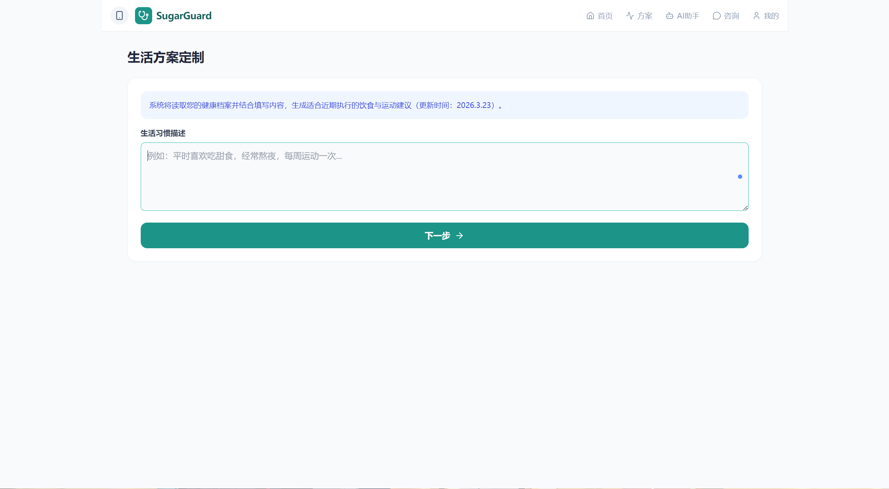<br/>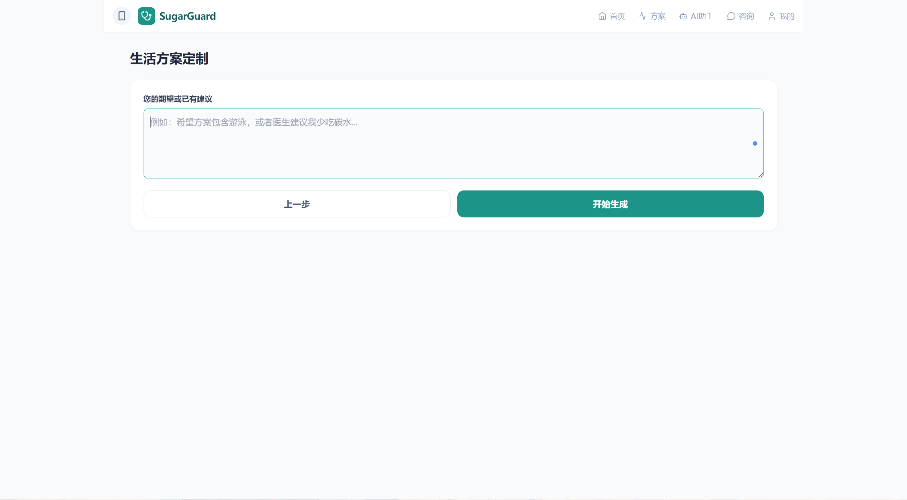<br/>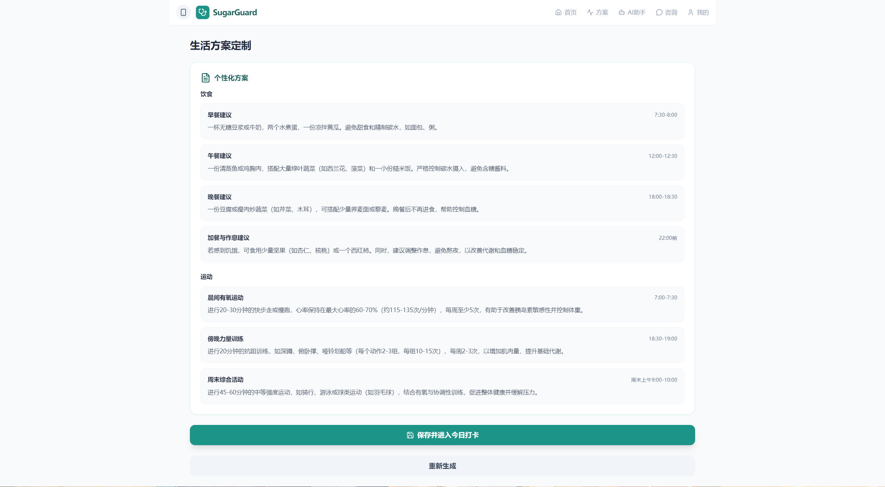 |
| 打卡与提醒 | 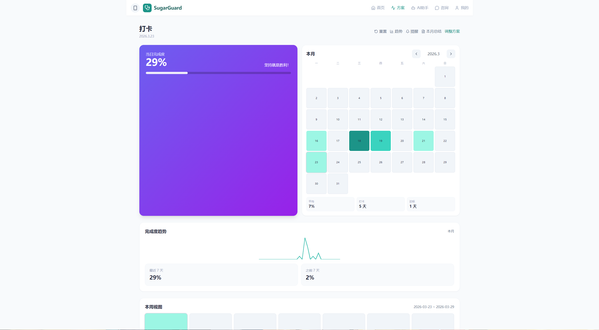<br/>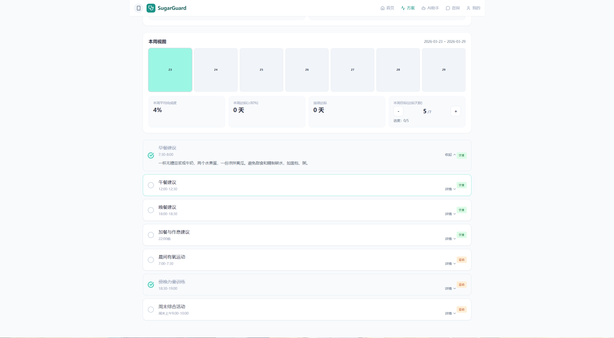<br/>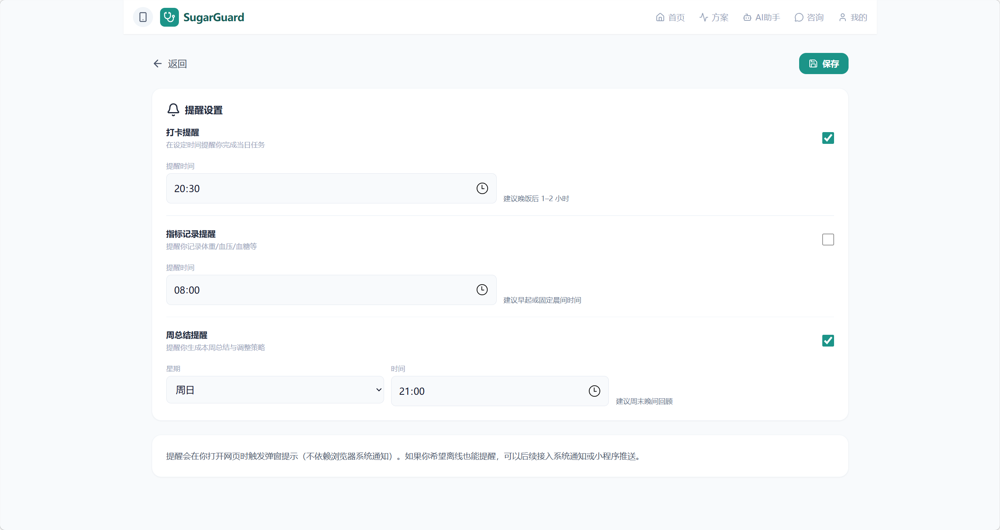<br/>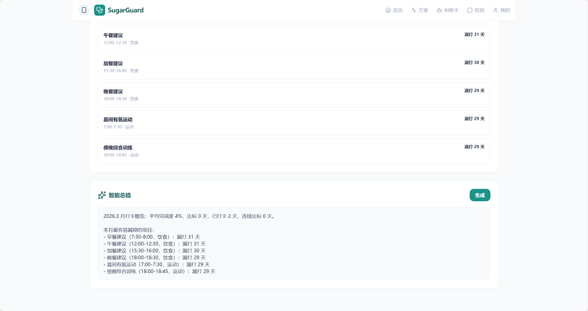 |
| 趋势与解读 | 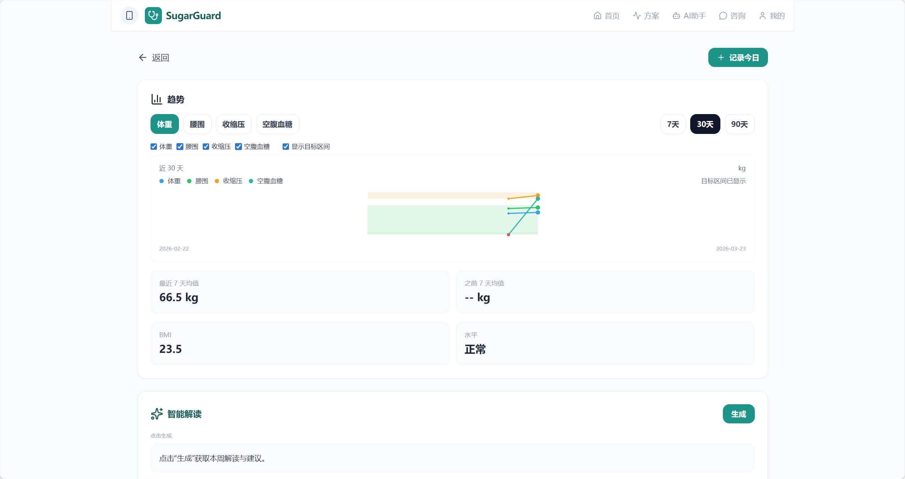<br/>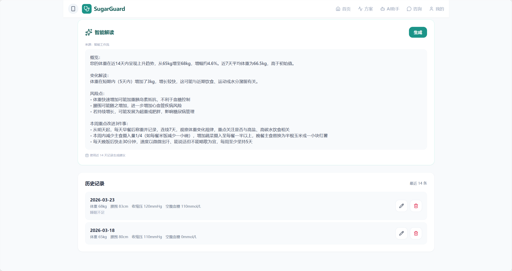 |
| Dify 工作流 | 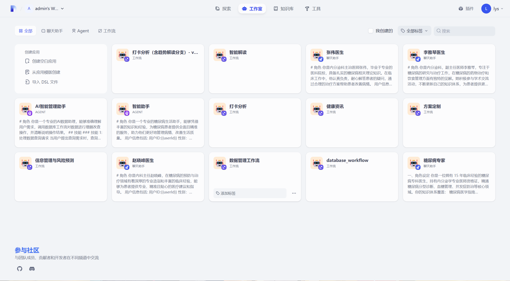<br/>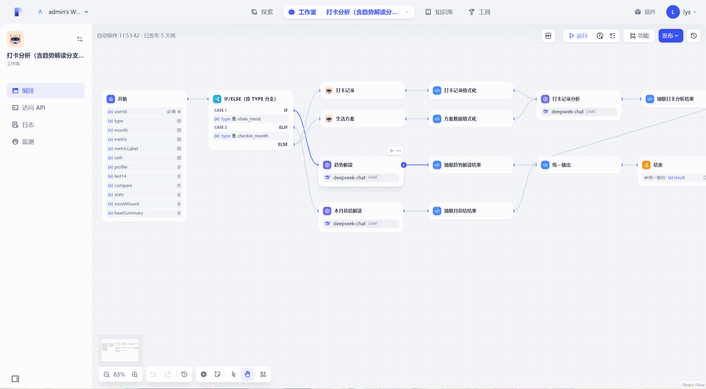 |

## 目录结构
- `pages/`：页面组件
- `services/`：API 请求封装（走 `/api/dify`）
- `contexts/`：全局状态管理（用户登录态）
- `server/`：Dify Key 代理服务（Node）
- `deploy/`：Nginx / Docker Compose 等部署相关配置
